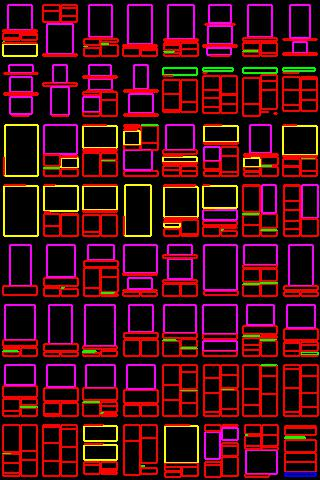

# Document experiment report
- commit: 0d02d10
- command: `python main.py --dataset doc --train --model_name doc`
- 6 trials with different seed
- tensorboard.dev: [URL](https://tensorboard.dev/experiment/v9p4O7IQQV69slJCWIEq9g/)

## Summary of code modification [[compare](https://github.com/JiananLi2016/LayoutGAN-Tensorflow/compare/master...ktrk115:master)]
- use PubLayNet dataset (# layouts: 170,457, class set: [text, title, list, table, figure])
- z shape [B, 128, 2] -> [B, 9, 9] last 9 means bbox (4) + cls_one_hot (5)
- adjust tensor sizes
- classes are sampled uniformly
- add 2 self-attention refinements; 4 stacks in total

## Results
- `doc1` in tensorboard
- colors:  text,  title,  list,  table,  figure

Real example | Transition during training | Final generated example
:--: | :--: | :--:
 |  | 
